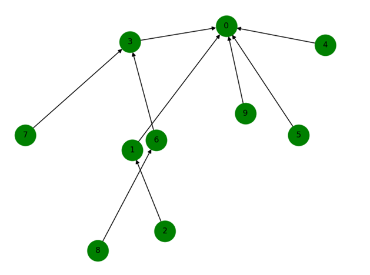
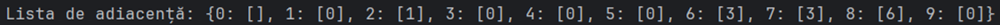
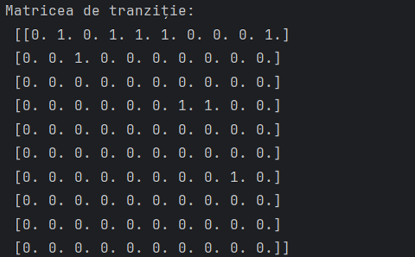
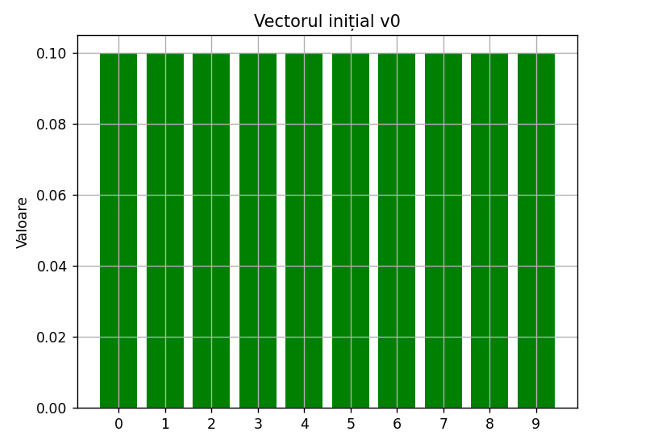
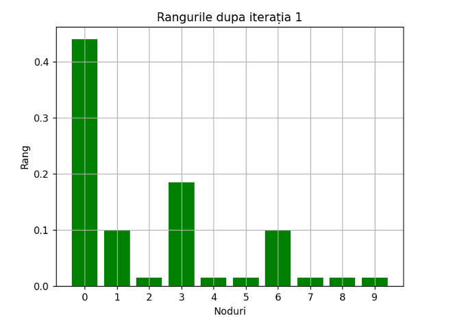
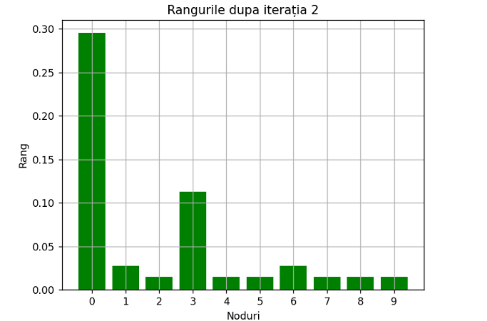
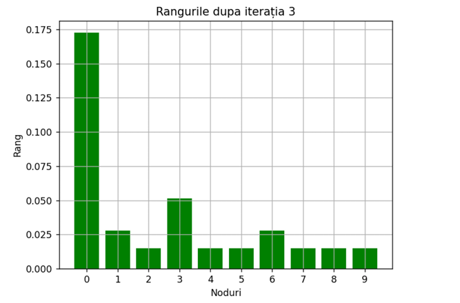
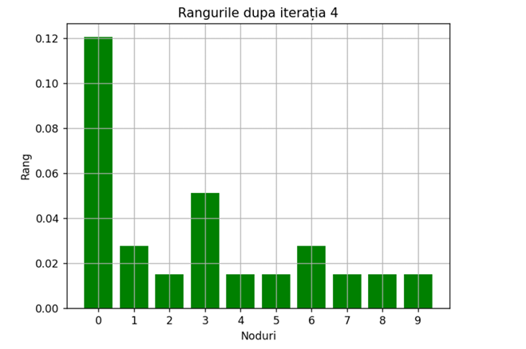
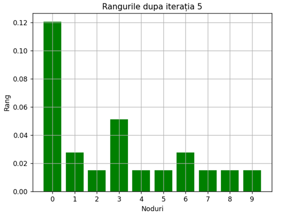

# Project Instructions 🧪

## Table of Contents 📋

1. [Instructions](#instructions)
2. [EX1: PageRank Algorithm Implementation](#pagerank-algorithm-implementation)
3. [Solution](#solution)
   - [Generating the Directed Graph](#generating-the-directed-graph)
   - [Representing the Graph as an Adjacency List](#representing-the-graph-as-an-adjacency-list)
   - [Constructing the Transition Matrix](#constructing-the-transition-matrix)
   - [Initializing the Initial Vector v₀](#initializing-the-initial-vector-v₀)
   - [PageRank Algorithm](#pagerank-algorithm)
   - [Calculating and Plotting Final Node Ranks](#calculating-and-plotting-final-node-ranks)
4. [Results](#results)

---

# Instructions 📋

In this laboratory, we will analyze the execution of the PageRank algorithm.

## PageRank Algorithm Implementation🧑‍💻

### Solution: 
This code implements the PageRank algorithm for a randomly generated directed graph using networkx.

#### Generating the Directed Graph🌐
A directed graph with 10 nodes is generated using `nx.gn_graph`. The seed is set to ensure reproducibility of the graph generation.

#### Representing the Graph as an Adjacency List🗂️
An adjacency list is built for the generated graph. This adjacency list is a dictionary where the keys are the nodes, and the values are the lists of successors for each node.

#### Constructing the Transition Matrix🔢
The transition matrix corresponding to the generated graph is constructed such that each element `M[i, j]` represents the probability of transitioning from node j to node i.

#### Initializing the Initial Vector v₀📊
The initial vector `v₀` is initialized with an equal value for each node (`1/n`).

#### PageRank Algorithm🧑‍💻
A function `pagerank` is defined to apply the PageRank algorithm to calculate the final ranks of the nodes. It uses an iteration method until the difference between iterations is under a certain threshold epsilon.

#### Calculating and Plotting Final Node Ranks📈
The final ranks of the nodes for each iteration of the PageRank algorithm are calculated and displayed. Each iteration is represented by a bar chart where the x-axis represents the nodes, and the y-axis represents the corresponding ranks. A grid is also added on the x and y axes to make it easier to read and interpret the graph.

---

### Results📊:
- Graph 

  
   
  <em>Graph</em>

- Adjacency List 

  
   
  <em>Adjacency Lis</em>

- Transition Matrix (M)

  
   
  <em>Transition Matrix</em>

Bar chart for the rankings of the n nodes:

  
   
  <em>v0: [0.1 0.1 0.1 0.1 0.1 0.1 0.1 0.1 0.1 0.1]</em>
   
  
   
  <em>Iteration 1: [0.44   0.1   0.015 0.185 0.015 0.015 0.1   0.015 0.015 0.015]</em>
   
  
   
  <em>Iteration 2: [0.2955   0.02775   0.015   0.11275   0.015   0.015   0.02775 0.015   0.015   0.015]</em>
   
  
   
  <em>Iteration 3: [0.172675   0.02775   0.015     0.0513375 0.015     0.015     0.02775   0.015    0.015   0.015]</em>
   
  
   
  <em>Iteration 4: [0.12047438 0.02775    0.015      0.0513375   0.015      0.015     0.02775    0.015      0.015      0.015]</em>
   
  
   
  <em>Iteration 5: [0.12047438 0.02775    0.015      0.0513375   0.015    0.015   0.02775    0.015      0.015      0.015]</em>

